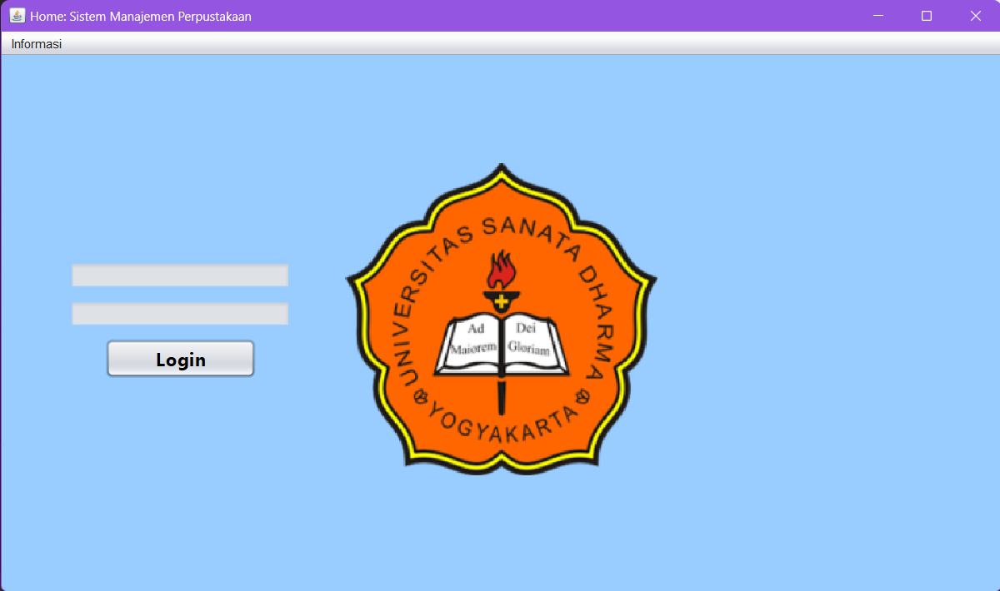
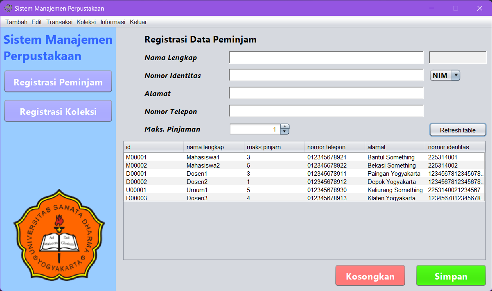
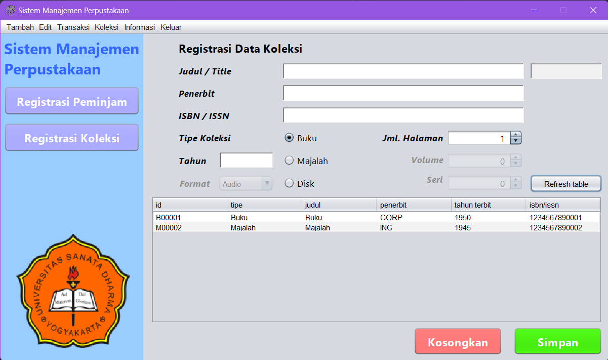
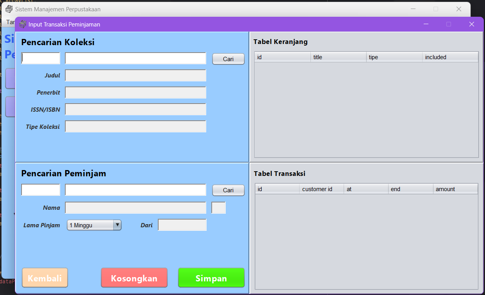

# Library Management System

This is a simple practice project to implement my current knowledge on Object-Oriented-Programming
in Java, specifically Java Swing GUI. The application serves the purpose of managing
library system. This program can be used to record transactions such as adding new 
collections, editing existing items, and handling customer item loans. The items
are going to be stored in a database.

### Application Flow

1. Home page (for logging in)
2. Main window

### Features 

- Login
- Registration forms for both customers and items
- Editing form to edit existing customers data and existing items
- Transactions form to manage item loans
- Koleksi/collection finder
- Information panel
- Logout
- Database

### Current Settings

The application is built with small resolution because the campus monitors does not
provide 1080p screen size. This application explicitly built adapting to the situation.

| Koleksi        | Configuration |
|:---------------|:--------------|
| Overall size   | 960 x 540     |
| Forms size     | 729 x 540     |
| -              | -             |
| -              | -             |

### User Interface

1. **Login Page**  
    This page contains the login form for the user to login to the application.
    
 
        
    

   
2. **Main window/customer registration**  
    This window contains the customer registration form.
    
 
        
    

   
3. **Main window/collection registration**  
    This window contains the collection registration form.
    
 
        
    

4. **Transaction/loan**  
    This frame contains the transaction form to manage item loans.
    
 
        
    

### How We Separate Forms

### Tools Used

- IntelliJ IDEA
- NetBeans (for GUI building)
